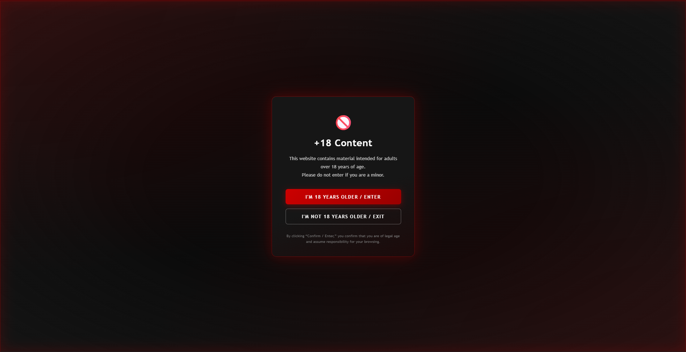
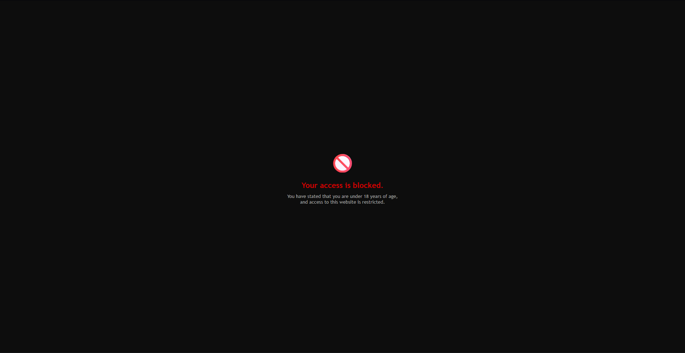

# AGE CHECKER

Hey folks, I'm sharing a project that you can place on your website to notify users that the content it contains is intended for adults, with self-declaration and storage via browser cookies. 
It's actually quite simple, but what matters is that it works.

## 🚀 Features

- Simple age self-declaration (Yes / No)
- Redirects underage users
- Stores decision using browser cookies
- Blocks access for 365 days if denied
- Remembers allowed users for 30 days

## 📸 Preview

- **First screen**
  

- **Blocked screen**
  

## ⚙️ Setup

1. Add the files to your project
2. Open `age-gate.html` as your entry page
3. Customize redirect URLs in `age-gate.js`

## 🎨 Customization

- Change redirect URLs in `age-gate.js`
- Modify styles in `age-gate.css`
- Adjust cookie duration (30 / 365 days)

## 🔒 Security Note

This script is frontend-based and relies on cookies.
For stronger enforcement, configure your server to always redirect users to the age check page before accessing other routes.